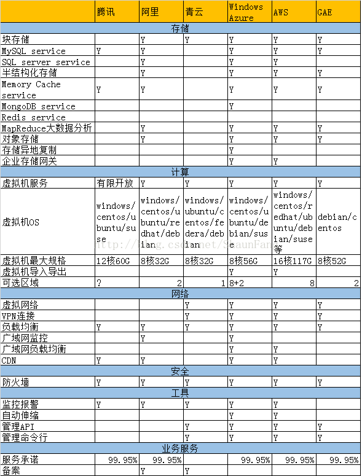
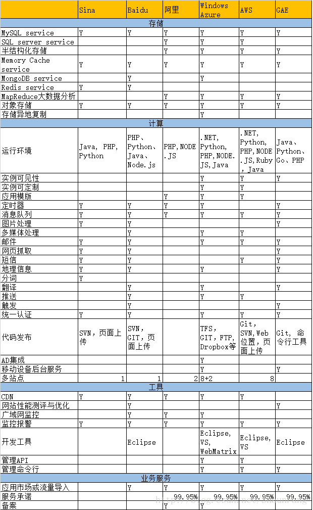

# TCSF &nbsp;&nbsp;&nbsp;&nbsp;&nbsp;&nbsp;&nbsp;&nbsp;&nbsp;&nbsp;&nbsp;&nbsp;&nbsp;&nbsp;&nbsp;&nbsp;&nbsp;&nbsp;&nbsp;&nbsp;&nbsp;&nbsp;&nbsp;&nbsp;&nbsp;&nbsp;&nbsp;&nbsp;&nbsp;&nbsp;&nbsp;&nbsp;&nbsp;&nbsp;&nbsp;&nbsp;&nbsp;&nbsp;&nbsp;&nbsp;&nbsp;&nbsp;&nbsp;&nbsp;&nbsp;&nbsp;&nbsp;&nbsp;&nbsp;&nbsp;&nbsp;&nbsp;&nbsp;&nbsp;&nbsp;&nbsp;&nbsp;&nbsp;&nbsp;&nbsp;&nbsp;&nbsp;&nbsp;&nbsp;&nbsp;&nbsp;&nbsp;&nbsp;&nbsp;&nbsp;&nbsp;&nbsp;&nbsp;&nbsp;&nbsp;&nbsp;&nbsp;&nbsp;&nbsp;&nbsp;&nbsp;&nbsp;&nbsp;&nbsp;&nbsp;&nbsp;&nbsp;&nbsp;&nbsp;&nbsp;&nbsp;&nbsp;&nbsp;&nbsp;💭

☸Test Cloud Server Functionality

☮提供一套对国内外云平台功能及服务进行测试的解决方案。

(不是对云的性能进行测试，而是针对各大云服务商所提供的云服务数量、差异性、完备性等进行测试)

💪CQNET组织致力于提供一套开源的“云功能测试”解决方案，正在努力中....

----------------------------

&nbsp;“云计算”这个词现在听到的次数没有前几年多了，当下的云已不再是最开始提供计算、存储这样的“水、电、气”的概念，而是一种可以包罗几乎所有信息技术的服务模式。

&nbsp;what’s IaaS PaaS and SaaS,and what’s the difference? 

&nbsp;这些云服务的概念想必大家都已经耳熟能详，而各种云服务，云应用也渗透到了我们的日常生活当中。但是否都能准确了解云服务的概念呢？这里还是再明确一下三者之间的关系及不同之处，典型的提供商及应用场景等。

&nbsp;IaaS（基础设施即服务 Infrastructure as a service），正如其名称描述的，为用户提供了计算基础架构，通常是提供了物理机/虚拟机，网络资源和其他资源，如虚拟机镜像库，块或者基于文件的存储，防火墙，负载均衡， IP地址，虚拟局域网等等， 主要的IaaS提供商：亚马逊的EC2，微软的Azure，Rackspace的OpenStack，IBM，VMWare的vCloud；国内的如阿里云（aliyun），青云（qingcloud）以及移动的大云（big cloud）等等。

&nbsp;PaaS（平台即服务 Platform as a service），正如其名称描述的，为用户提供计算平台通常包括操作系统，编程语言的运行环境，数据库，Web服务器等。一些主要的服务提供商：AWS Elastic Beanstalk，Heroku，Force.com，谷歌的GAE（ Google App Engine），新浪SAE，百度云的开发引擎等。

&nbsp;SaaS（软件即服务 Software as a service）为用户提供了被称为按需支付费用（on-demand）的应用软件。用户不必在去操心各种应用程序的安装，设置和运行维护。一切都由SaaS服务提供商来完成。户只需要支付费用，通过一些可视化的客户端来使用它。如：谷歌的Apps，微软的Office 365，Citrix的CloudStack，以及目前比较火的各种云存储（网盘），云相册，云备份，云打印，云监控等正对个人用的云服务产品。 

&nbsp;总之，IaaS，PaaS，SaaS等等的各类云服务已经深入到了我们的时代，不仅为企业提供了广阔的平台，为开发者提供的优良的开发环境，也为普通消费者提供了低廉，安全，便捷的各项服务，云时代已经开启。

| 云服务商 | 相同性服务 | 差异性服务 | 服务数量 | 特色服务 | Pic|
| :--------: | :---------: | :---------: | :---------: | :---------: | :---------:| 
|腾讯||||||
|阿里||||||
|Baidu||||||
|青云||||||
|Sina||||||

-------------------

图片来自网络，如有侵权，告之立删！

推荐文章：

[国内外公有云对比：功能介绍、性能测试](https://blog.mimvp.com/article/13351.html)

 

